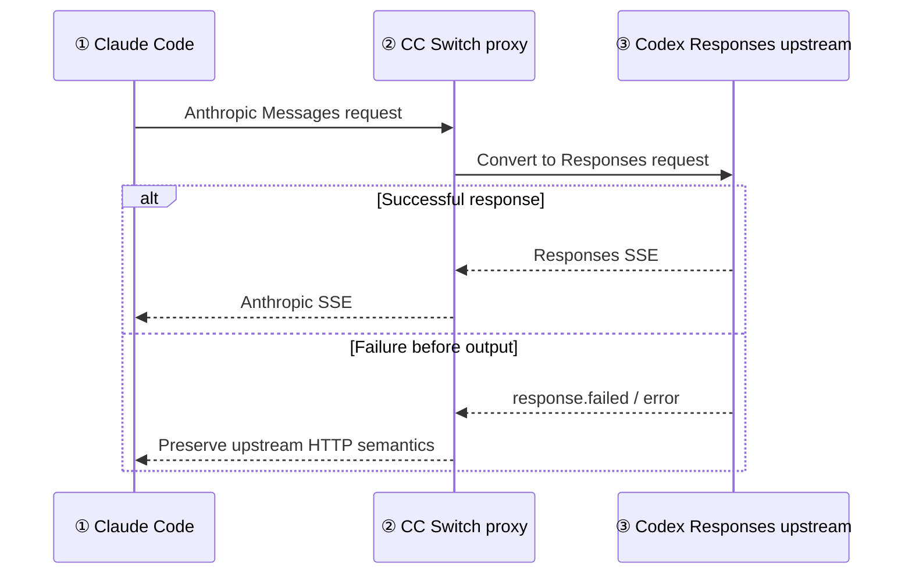
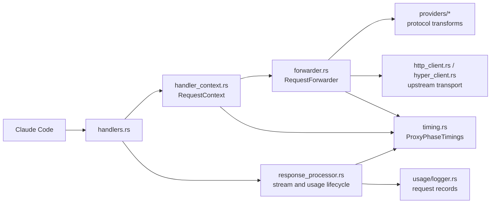
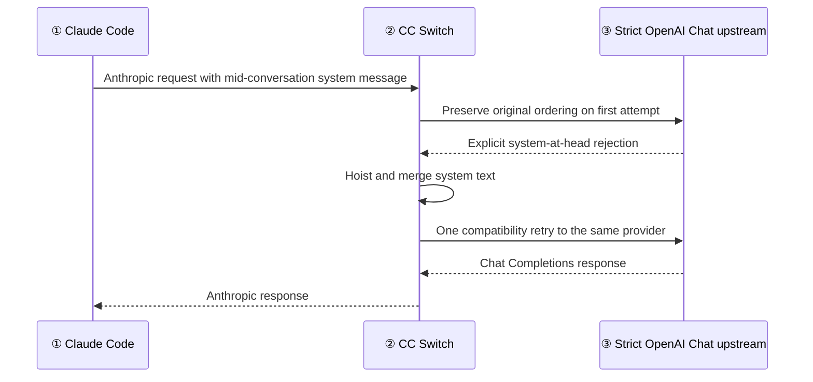
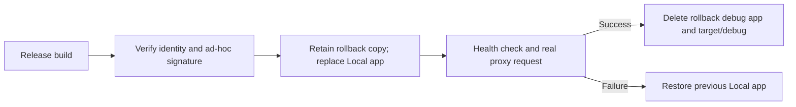

# Claude Protocol Adapter and Proxy Diagnostics Plan

Human-oriented companion: [IMPLEMENTATION_PLAN_HUMAN.md](IMPLEMENTATION_PLAN_HUMAN.md).

## Scope

Primary production route:

- downstream client: Claude Code using Anthropic Messages;
- local bridge: CC Switch;
- upstream: managed Codex account using OpenAI Responses.

Two defects discovered while validating that route are also in scope because they affect the same Claude entry point and proxy transport:

- strict OpenAI Chat upstreams such as `mlx_lm.server`, which require every system instruction at the beginning;
- explicit global proxies that must not intercept loopback model endpoints.

Unrelated Gemini Native, xAI, and Copilot protocol behavior remains out of scope.

## Module ownership

- `handlers.rs` owns request entry and final error attribution.
- `RequestContext` owns request-scoped identity and the shared timing handle.
- `RequestForwarder` owns conversion, provider attempts, compatibility retry, semantic priming, and upstream transport selection.
- Provider modules own protocol-specific reasoning and message transformations.
- `response_processor.rs` owns downstream completion, first-output timing, and usage lifecycle.
- `timing.rs` stores only counters and the mapped outbound model; it never stores request or response content.

## Stage 1: Reproduce and classify | Goal: Separate upstream capacity failures from bridge defects | Status: Complete

- Installed application: 3.20.4; working tree: 4.0.1.
- Six observed overload failures target `https://chatgpt.com/backend-api/codex/responses`.
- Failures occur with one or two overlapping requests; high-volume minutes also complete successfully.
- Defect: a pre-output Responses `service_unavailable_error` is represented as `ProxyError::TransformError`, so the downstream status becomes 422 instead of 529.
- The bridge decodes replayed `redacted_thinking`, but streamed opaque Responses reasoning was emitted back to Claude Code as `redacted_thinking`; live testing reproduced a client compatibility failure on that block type.

## Stage 2: Regression tests | Goal: Lock failure semantics and reasoning replay | Status: Complete

- Add a forwarder test asserting a pre-output `service_unavailable_error` becomes `ProxyError::UpstreamError { status: 529, ... }`.
- Add mapping tests for rate limiting and unknown upstream failures.
- Cover generic `type="error"` with specific `code` in standalone SSE and nested JSON: rate limiting → 429, capacity failure → 529, invalid request → 400; assert retryable/non-retryable categorization and explicit numeric status precedence.
- Red/green evidence: `responses_generic_error_type_uses_specific_code_for_classification` failed before the type/code selection fix and passed afterward; `responses_explicit_numeric_status_precedes_error_code_and_numeric_code_is_not_diagnostic` passed after the fix.
- Cover both replay directions: decode historical `redacted_thinking` into Responses reasoning, and emit opaque Responses reasoning as a signed `thinking` placeholder rather than `redacted_thinking`.
- Prove the streaming bridge emits one ordered thinking start → placeholder delta → signature delta → matching block stop, with no later delta for the closed index; decode the signature and compare the complete reasoning item.
- Tests must fail before implementation for the 529 defect.

## Stage 3: Implement semantic error adaptation | Goal: Preserve retryable upstream status | Status: Complete

- Centralize extraction of Responses semantic failures from JSON and SSE envelopes.
- Map explicit numeric statuses first. Preserve a specific error `type`; when it is generic `error` or empty, prefer a meaningful string `code`. Numeric codes affect HTTP status but do not become diagnostic labels. Default unknown pre-output upstream failures to 502, never 422.
- Reuse `ProxyError::UpstreamError` so existing status mapping, failover categorization, request logging, and client retry behavior remain consistent.
- Preserve opaque Codex reasoning in the existing signed envelope, but expose it as a normal Anthropic `thinking` block with a placeholder summary so Claude Code never receives the incompatible `redacted_thinking` type.
- Do not add same-provider retries for Responses capacity failures: Claude Code receives 529 and controls retry/backoff; configured CC Switch failover remains available.

## Stage 4: Validate local build | Goal: Prove the scoped bridge works end-to-end | Status: Complete

- Run targeted Rust tests first, then `cargo fmt --check`, `cargo clippy -- -D warnings`, and the Rust library suite.
- Build the local application without updater signing artifacts; package a directly executable macOS `.app`.
- Install and run the independently named Local application without replacing `/Applications/CC Switch.app`.
- Confirm overload events are logged/returned as upstream 529 and `redacted_thinking` history no longer produces an unsupported-content failure.
- Live evidence: overload logged as 529; after the packaged app started, five successful requests emitted nine `thinking` blocks and zero `redacted_thinking` blocks.

## Stage 5: Performance and transport diagnostics | Goal: Attribute latency and stream failures without recording content | Status: Complete

- A request-scoped atomic timing object follows `RequestContext` through provider selection, retries, forwarding, semantic stream priming, and response completion.
- `[PERF]` records contain identifiers plus durations only: `app`, `session`, `outcome`, `attempts`, `outbound_model`, `context_ms`, `request_prepare_ms`, `upstream_headers_ms`, `stream_first_chunk_ms`, `semantic_prime_ms`, `first_output_ms`, `after_first_ms`, and `total_ms`.
- Retry attempts accumulate in the same record instead of overwriting one another; the final mapped upstream model is retained separately from the incoming Claude model alias.
- Reqwest streaming-body failures preserve the nested source chain after URL removal, so `error decoding response body` can reveal truncation, HTTP/2, or transport causes without logging response content or credentials.
- Regression coverage includes timing accumulation, outbound-model capture, nested transport-error formatting, and response streaming.

## Stage 6: Local OpenAI Chat compatibility | Goal: Support strict local model servers without weakening default semantics | Status: Complete

- Preserve system-message ordering on the first request for providers that support it.
- Retry only for the exact strict-upstream rejection on Claude → `openai_chat`, with status 400, 404, or 422.
- Hoist every system message into the leading system content while preserving the order of all non-system messages.
- Attempt the compatibility retry once per provider; a second failure returns to the normal failover/error path.
- Attach `NoProxy` to explicit global proxies while preserving existing `NO_PROXY`/`no_proxy` entries and always adding `localhost`, `127.0.0.0/8`, and `::1`.
- Use a real local target plus a real rejecting proxy in the regression test so success proves that loopback traffic bypassed the proxy rather than relying on a conventionally unused port.

## Stage 7: Production installation | Goal: Replace the Local debug app with a validated release app and reclaim debug artifacts | Status: Complete

- Reproducible command: `bash scripts/build-local-macos.sh`; the script runs `pnpm tauri build --bundles app -c src-tauri/tauri.local.conf.json`, fixes the bundle's deep-link scheme, ad-hoc signs it, and verifies the signature.
- The repository's shared `Info.plist` otherwise overrides the plugin scheme with `ccswitch`; fixing the Local bundle after generation prevents it from capturing the official application's deep links.
- Overlay identity: `productName="CC Switch Local"`, `identifier="com.ccswitch.local"`, deep-link scheme `ccswitch-local`; updater endpoints and updater-artifact generation are disabled.
- Use the existing release profile (`opt-level="s"`, thin LTO, stripped symbols), without `--debug`; keep version 4.0.1.
- Preserve `/Applications/CC Switch.app`, `~/.cc-switch`, and Claude Code settings. Replace only `/Applications/CC Switch Local.app` after signature validation.
- Preserve the old Local app as a temporary rollback copy until startup, `/health`, and a representative Claude Messages proxy request succeed.
- Delete only the inspected `src-tauri/target/debug` directory and the old debug-app copy after the successful switch; keep release artifacts, the latest release-app rollback copy, and all user logs/configuration.

### Final verification — 2026-10-07

- `cargo fmt --check` and `cargo clippy --all-targets --all-features -- -D warnings` passed.
- Latest automated Rust library run: 3338 passed, 0 failed, 9 ignored, 1 filtered out. The fixed-port provider test is excluded while the live app owns 15721 and is included, fully qualified with `--exact`, in the manual replacement commands before the app swap; its terminal output is not part of the automated log.
- Frontend: typecheck and format checks passed; 184 test files and 2147 tests passed.
- Installed and running Local binary matches the final signed bundle: SHA256 `44c0fd233dc9cda2afe7f20a8c8678e3604ea8a45ea50d7e7d4b35b6d25c8941`. Identity remains `com.ccswitch.local`, version 4.0.1, scheme `ccswitch-local`.
- Installed release `/health` returned healthy. A real streaming Claude Messages request returned HTTP 200, exactly `RELEASE_OK`, and one `message_stop` in 2.38 seconds.
- Official application binary hash is unchanged. Context/output/thinking settings remain 393216 / 286720 / 32768 / 16384.
- Removed debug artifacts: 28.07 GiB; project footprint fell from 30.78 GiB to 2.84 GiB. Kept `target/release`, the latest small release rollback, configuration, and historical logs.
