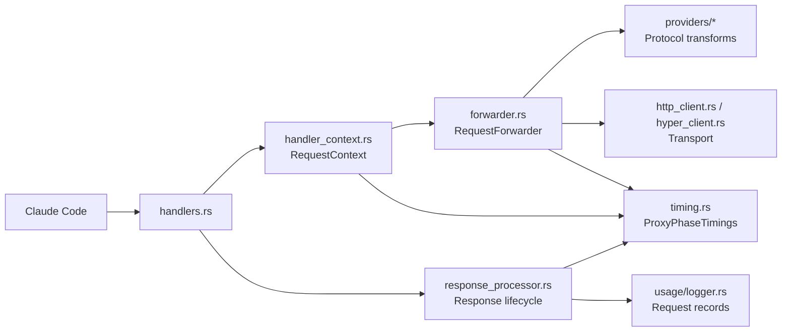
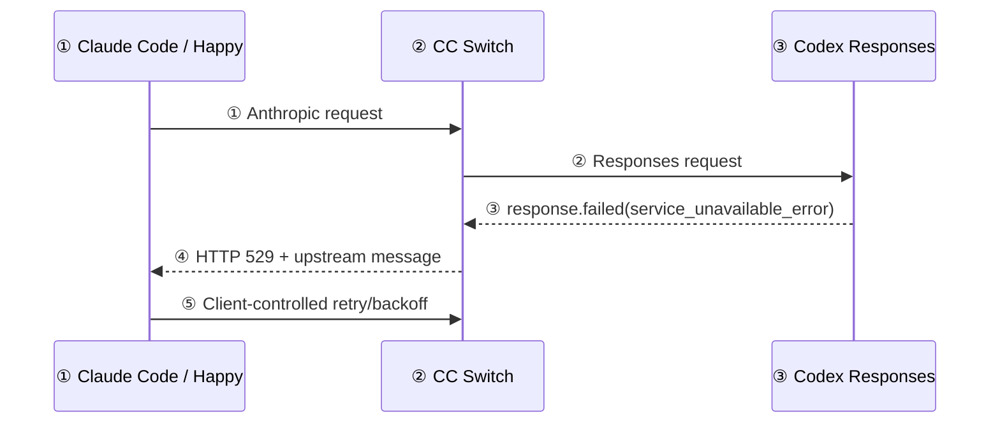
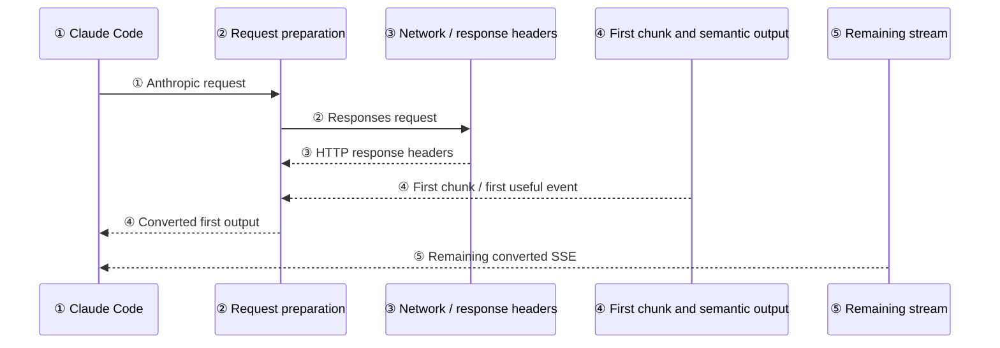
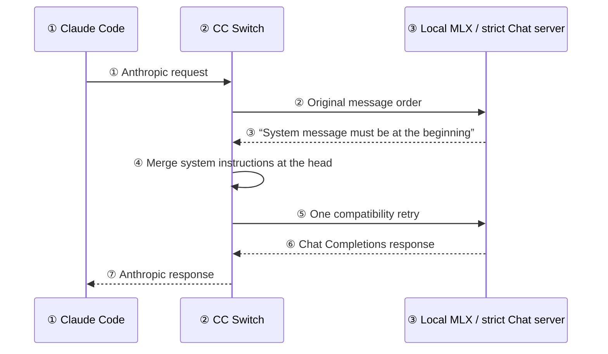
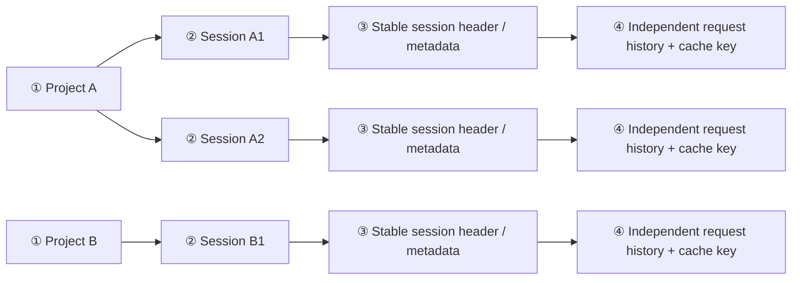
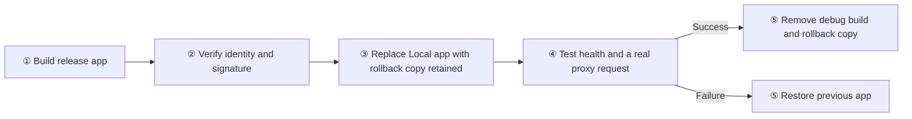

# Claude Adapter and Local Proxy: Review Guide

Exact implementation contracts and test names live in [IMPLEMENTATION_PLAN.md](IMPLEMENTATION_PLAN.md).

## Reading guide

Start with the one-page summary, then read the Codex failure flow. The performance section explains where time is spent, while the local-model section covers the narrower compatibility retry used by strict OpenAI Chat servers. The final section explains project and session isolation.

## One-page summary

| Area | Conclusion |
| --- | --- |
| Primary route | Claude Code speaks Anthropic Messages to CC Switch; CC Switch talks OpenAI Responses to managed Codex. |
| Actual overload source | The Codex Responses upstream returned `service_unavailable_error`; CC Switch itself did not saturate. |
| Why the client saw 422 | CC Switch classified the upstream semantic failure as a format-conversion error. |
| Correct overload behavior | Preserve it as upstream 529 so Claude Code can apply normal retry behavior. |
| Multi-session evidence | Failures occurred with only one or two overlapping requests, while busier minutes succeeded. |
| `redacted_thinking` | Opaque reasoning now travels as a signed ordinary `thinking` placeholder, while its original Responses item remains replayable. |
| Responses retry policy | No hidden same-provider retry for capacity errors; return the correct status and retain configured failover. |
| Strict local Chat policy | Preserve message order first; retry once only after the upstream explicitly rejects a mid-conversation system message. |
| Loopback routing | Explicit Clash/HTTP/SOCKS proxies must never intercept `localhost`, `127.0.0.0/8`, or `::1` model endpoints. |

## Module map



| Module | Responsibility |
| --- | --- |
| `handlers.rs` | Accepts proxy requests and records terminal errors with the actual mapped model. |
| `handler_context.rs` | Selects provider/session context and creates the shared request timing object. |
| `forwarder.rs` | Converts requests, performs provider attempts, applies bounded compatibility handling, and validates early upstream failures. |
| `providers/*` | Owns protocol-specific message, reasoning, and streaming transformations. |
| `http_client.rs` / `hyper_client.rs` | Chooses direct/proxied transport, protects loopback routing, and preserves safe transport error causes. |
| `response_processor.rs` | Drives downstream stream completion, first-output measurement, and usage collection. |
| `timing.rs` | Accumulates phase durations, attempt count, and mapped outbound model without storing message content. |
| `usage/logger.rs` | Persists request records with upstream model and incoming request model kept separate. |

Arrow semantics: arrows show ownership handoff or data flow; the timing object is shared by context creation, forwarding, and response completion.

## Codex request and failure flow



1. **① Client request:** Happy transports a normal Claude Code request; the entire conversation state may be included, not merely the newest user sentence.
2. **② Protocol conversion:** CC Switch converts Anthropic Messages into the Responses request shape expected by Codex.
3. **③ Upstream failure:** Codex can return a failure event inside an HTTP-successful SSE connection before producing model output.
4. **④ Correct classification:** CC Switch translates the semantic error into upstream status 529 rather than local conversion status 422.
5. **⑤ Retry ownership:** Claude Code decides when to retry a capacity failure. This avoids a local retry storm while allowing the client to recover normally.

Arrow semantics: solid arrows are request/response transmission; numbered labels show execution order.

An error can arrive with the generic label `type: "error"` and a more informative `code`, such as `rate_limit_exceeded`. The bridge uses the specific code in that case rather than losing the distinction. Explicit numeric HTTP statuses still take precedence: rate limiting maps to 429, capacity failure to 529, and invalid input to 400. The last case must not fail over to another provider with the same invalid request.

## Why this is not primarily a multi-session defect

The captured failures were short (about 1.8–4.9 seconds) and occurred with at most two overlapping requests. Two failures occurred with one active session and one request. The same upstream completed requests during minutes containing more traffic. This pattern matches transient model-route capacity pressure, not a deterministic CC Switch concurrency ceiling.

Happy can increase request volume by keeping multiple sessions active, but the evidence does not show Happy-specific payload corruption or local server exhaustion. Correcting the status code gives Happy and Claude Code the information they need to recover.

## Reasoning compatibility

OpenAI Responses may return readable reasoning summaries, opaque encrypted reasoning, or both. Claude Code rejected the Anthropic `redacted_thinking` block previously used for opaque items, so the bridge now emits a normal `thinking` block containing `[redacted thinking]` and carries the complete original Responses reasoning item in its signature envelope.

This is not a lossy replacement: when Claude Code replays the assistant message during a later tool turn, CC Switch decodes that signature and reconstructs the original `reasoning` item, including `encrypted_content`. Foreign Anthropic `redacted_thinking` payloads that do not contain a CC Switch envelope are not forwarded into Responses input.

## Performance observability



1. **① Context setup:** CC Switch identifies the app, session, provider, and routing policy; this becomes `context_ms`.
2. **② Request preparation:** model mapping plus protocol conversion becomes `request_prepare_ms`.
3. **③ Connection and headers:** proxy connection, TLS, upstream queueing, and header wait become `upstream_headers_ms`.
4. **④ First output:** raw first-chunk wait and Responses semantic priming are recorded separately; `first_output_ms` is the end-to-end user wait.
5. **⑤ Remaining stream:** `after_first_ms` separates later generation/tool-call time from time-to-first-output; `total_ms` closes the request.

Arrow semantics: solid arrows show request or stream progression; numbered labels match the ordered explanation. Timing records also include `attempts`, `outcome`, and the actual `outbound_model`. They never include prompt text, response content, credentials, or unredacted URLs.

Nested reqwest/hyper source errors are retained after URL removal. A generic `error decoding response body` can therefore be diagnosed as a concrete chunking, EOF, broken-pipe, or connection-closure failure without exposing request data.

## Strict local OpenAI Chat compatibility



1. **① Preserve input:** CC Switch receives the same Claude request used for the Codex route.
2. **② Prefer semantics:** the first OpenAI Chat request preserves mid-conversation system-message ordering for upstreams that support it.
3. **③ Require explicit evidence:** only the exact strict-server rejection, with HTTP 400, 404, or 422, enables compatibility handling.
4. **④ Hoist safely:** all system text is merged into the leading system content; non-system messages keep their original order.
5. **⑤ Bound the retry:** CC Switch retries the same provider once. A second failure returns to the normal error/failover path rather than looping.
6. **⑥ Receive output:** a compatible local server can now produce its ordinary Chat Completions response.
7. **⑦ Preserve the client contract:** CC Switch converts the result back to Anthropic protocol for Claude Code.

Arrow semantics: solid arrows are network requests/responses; the self-arrow is the local compatibility transformation. The retry is schema-specific and is unrelated to Codex capacity retry policy.

Even when a global proxy is configured, loopback upstreams go direct. The regression test runs both a real loopback target and a real proxy that would return 502 if contacted; HTTP 200 from the target and zero proxy hits prove the bypass.

## Session isolation in the Claude-to-upstream bridge



1. **① Project boundary:** Claude Code owns project/worktree state and constructs each session's complete message history; CC Switch does not merge project conversations.
2. **② Session boundary:** every Claude Code conversation has its own stable session identifier.
3. **③ Identity extraction:** CC Switch prefers `x-claude-code-session-id` / `claude-code-session-id`, then Anthropic metadata; generated IDs are never used as durable upstream cache identity.
4. **④ Continuity:** the full Anthropic message history and signed reasoning envelopes travel in the request. The stable session ID scopes prompt caching, logs, and provider-specific state that requires a session key.

Arrow semantics: each branch remains independent; no arrow joins two sessions. Provider health and routing state may be shared application-wide, but conversation content is not.

## Production Local app

The optimized Local app keeps the same application identity and shared configuration as the debug Local app, while remaining separate from the official application. Build it from the repository root with:

```sh
bash scripts/build-local-macos.sh
```

The script uses [tauri.local.conf.json](src-tauri/tauri.local.conf.json), corrects the generated bundle's deep-link registration, and ad-hoc signs and verifies the result. The shared `Info.plist` still belongs to the official build and is not modified.



1. **① Build:** omit `--debug` to use optimized code, thin LTO, and stripped symbols. Version stays 4.0.1.
2. **② Verify:** confirm `com.ccswitch.local`, the `ccswitch-local` deep-link scheme, disabled official updater endpoints, and a valid ad-hoc signature. Ad-hoc signing is suitable for this machine, not notarized distribution.
3. **③ Replace:** replace only `/Applications/CC Switch Local.app`; the official `/Applications/CC Switch.app` and all provider/client configuration stay intact. The apps share the proxy port and must not run together.
4. **④ Exercise:** require a healthy local endpoint and a successful representative Claude Messages request through the installed release app, not merely a running process.
5. **⑤ Finish safely:** remove `src-tauri/target/debug` and the retained debug-app copy only after validation. If validation fails, restore the previous app instead. Release build artifacts, the latest small release-app rollback copy, user configuration, and historical logs are retained.

Arrow semantics: arrows show installation order; success and failure have separate cleanup/rollback paths.

### Verified result — 2026-10-07

The final Local release is installed and running. Its binary matches the signed build, the official application is unchanged, and the context/output/thinking settings remain 393216 / 286720 / 32768 / 16384. A real streaming request returned HTTP 200, exactly `RELEASE_OK`, and a normal stream-end event in 2.38 seconds.

| Check | Measured result |
| --- | --- |
| Rust format and strict clippy | Passed |
| Automated Rust library tests | 3338 passed, 0 failed, 9 ignored; 1 fixed-port test excluded while the app was running |
| Frontend validation | Typecheck and format passed; 184 files / 2147 tests passed |
| Installed app | Valid signature; binary matches the final release bundle; version stays 4.0.1 |
| Debug cleanup | 28.07 GiB removed; project footprint fell from 30.78 GiB to 2.84 GiB |
| Retained data | Official app, release artifacts, latest small release rollback, configuration, and historical logs |

The manual replacement commands run the excluded provider test by its full name with `--exact` while the application is stopped. That terminal output is not captured in the automated test log. Exact binary hash and validation contracts remain in the implementation companion.

## Verification standard

The change is complete only when:

- synthetic `service_unavailable_error`, rate-limit, and unknown semantic failures map to 529, 429, and 502 respectively, including generic error labels with specific codes; numeric status precedence and non-retryable invalid-input handling are preserved;
- historical opaque reasoning round-trips losslessly while outbound Anthropic streams contain no `redacted_thinking`; the opaque stream test checks matching block indexes, event order, and complete signature decoding;
- the strict Chat retry preserves original ordering first, hoists system text only after the explicit rejection, and makes only one compatibility retry per provider;
- a real rejecting proxy records no hit for a successful loopback request;
- formatter, strict lints, targeted tests, and the Rust library suite pass;
- the packaged local application reproduces the real Claude-to-Codex route without replacing the official application.
